 

# 👋 Hi, I'm MetaScorp

**Engineer · Builder · Innovator**

  

## 🧑‍💻 About Me

As an engineer, I enjoy solving problems, designing solutions, and figuring out how things work. I like tinkering with technology, exploring random ideas, and actually turning them into useful code. My work mainly revolves around artificial intelligence, data analysis, automation, and algorithms. I enjoy taking an idea from “this might work” to something that actually works, and then experimenting with it to see how far I can push it or how I can improve it. This is my little techy, nerdy space on the internet, where I document some of the projects I'm working on, experiments I'm trying out, and things I'm learning along the way.

 

  
  &nbsp;&nbsp;&nbsp;
  
  &nbsp;&nbsp;&nbsp;
  
  &nbsp;&nbsp;&nbsp;
  

 

## 🔭 What I'm Exploring

<table>
<tr>
<td><strong>Artificial Intelligence</strong></td>
<td>████████████████████████░░</td>
<td><strong>90%</strong></td>
</tr>

<tr>
<td><strong>Data & Machine Learning</strong></td>
<td>███████████████████████░░░</td>
<td><strong>85%</strong></td>
</tr>

<tr>
<td><strong>Software Development</strong></td>
<td>██████████████████████░░░░</td>
<td><strong>80%</strong></td>
</tr>

<tr>
<td><strong>Cloud & Deployment</strong></td>
<td>███████████████████░░░░░░░</td>
<td><strong>70%</strong></td>
</tr>

<tr>
<td><strong>Algorithms & Problem Solving</strong></td>
<td>███████████████████████░░░</td>
<td><strong>85%</strong></td>
</tr>
</table>

  <i>Always learning. Always experimenting.</i>

 

## 🚀 Projects

<table>
<tr>
<td width="50%" valign="top">

### 🤖 Crypto Telegram Bot

Telegram bot to view the live crypto market using Telegram BotFather api.

</td>

<td width="50%" valign="top">

### 📈 Stock Market Analysis

Stock market behaviour through historical data using Monte Carlo simulation.

</td>
</tr>

<tr>
<td width="50%" valign="top">

### 📱 Campus Connect

Android app designed for college work activities.

</td>

<td width="50%" valign="top">

### 🧠 Data Structure Master

A project for practicing data structures and algorithms.

</td>
</tr>

<tr>
<td width="50%" valign="top">

### 🎮 Rock Paper Scissors

A simple C++ game and programming exercise.

</td>

<td width="50%" valign="top">

### 🧪 More Experiments

Always experimenting with new ideas, tools, and technologies.

</td>
</tr>
</table>

 

## 🧰 Tech Stack

&nbsp;&nbsp;&nbsp;

&nbsp;&nbsp;&nbsp;

&nbsp;&nbsp;&nbsp;

&nbsp;&nbsp;&nbsp;

&nbsp;&nbsp;&nbsp;

&nbsp;&nbsp;&nbsp;

&nbsp;&nbsp;&nbsp;

&nbsp;&nbsp;&nbsp;

&nbsp;&nbsp;&nbsp;

&nbsp;&nbsp;&nbsp;

&nbsp;&nbsp;&nbsp;

&nbsp;&nbsp;&nbsp;

&nbsp;&nbsp;&nbsp;

&nbsp;&nbsp;&nbsp;

&nbsp;&nbsp;&nbsp;

&nbsp;&nbsp;&nbsp;

&nbsp;&nbsp;&nbsp;

&nbsp;&nbsp;&nbsp;

&nbsp;&nbsp;&nbsp;

&nbsp;&nbsp;&nbsp;

 

`Python` · `Java` · `C++` · `JavaScript` · `TypeScript` · `Node.js` · `SQL` · `PostgreSQL` · `Pandas` · `NumPy` · `Scikit-learn` · `TensorFlow` · `PyTorch` · `PySpark` · `Azure` · `AWS` · `GCP` · `Docker` · `Kubernetes` · `Git`

 

## 🐍 Contribution Graph

<picture>
  <source
    media="(prefers-color-scheme: dark)"
    srcset="https://raw.githubusercontent.com/MetaScorp/MetaScorp/output/github-contribution-grid-snake-dark.svg"
  />
  <source
    media="(prefers-color-scheme: light)"
    srcset="https://raw.githubusercontent.com/MetaScorp/MetaScorp/output/github-contribution-grid-snake.svg"
  />
  
</picture>

 

## 📊 GitHub Stats

&nbsp;&nbsp;&nbsp;

  

### `Build. Learn. Improve.`

*Turning curiosity into code.*

